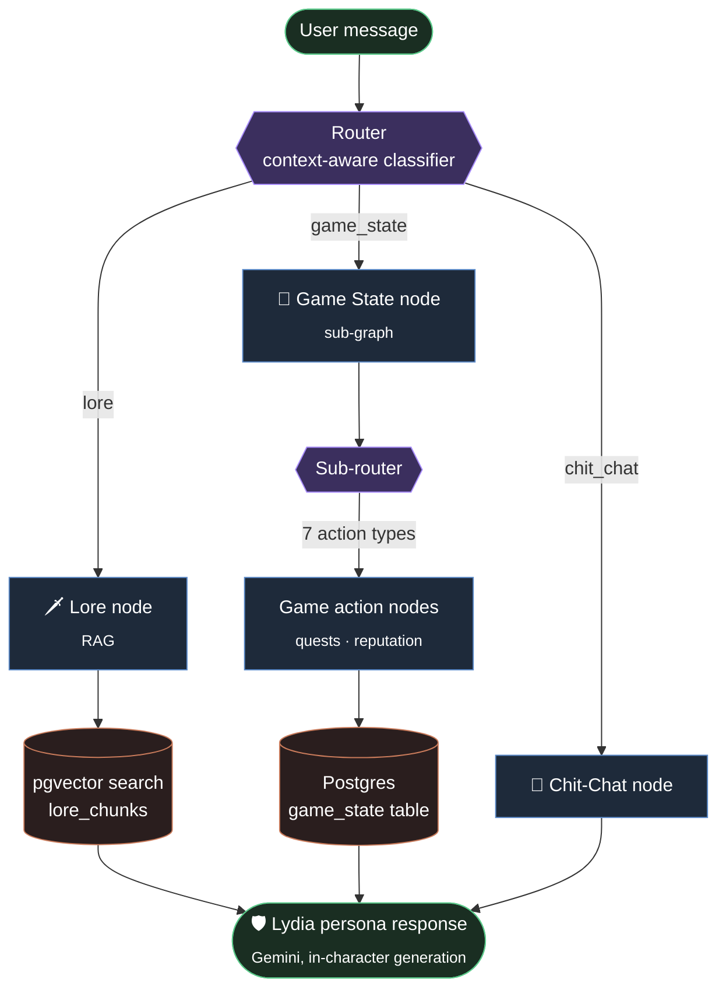

# Lydia — A Skyrim Companion RAG Chatbot

Talk to Lydia, Housecarl of Whiterun, as if she's actually there. Lydia is an in-character conversational AI built on a retrieval-augmented generation (RAG) pipeline, grounded in custom Skyrim lore, with persistent game state (quests, reputation) tracked per player session.

This is a portfolio project demonstrating a production-style agentic RAG architecture: multi-node routing, context-aware query reformulation, vector search over a custom knowledge base, and an evaluation harness for measuring response faithfulness.

---

## Features

- **In-character conversation** — Lydia responds in her own voice, grounded in lore, and never breaks character or reveals she's an AI.
- **Retrieval-augmented lore** — Questions about Skyrim world lore, NPCs, factions, and history are answered using semantic search over a custom knowledge base, not the base model's general knowledge.
- **Context-aware routing** — A LangGraph router classifies each message into `lore`, `game_state`, or `chit_chat`, using recent conversation history so short or ambiguous follow-ups ("yes", "no", "yes i am") are classified correctly rather than in isolation.
- **Query reformulation** — Follow-up messages are rewritten into standalone queries before retrieval, resolving references and conversational context (e.g. an affirmative reply to a question Lydia asked) so retrieval and generation both receive an unambiguous input.
- **Persistent game state** — Active quests, completed quests, and player reputation are tracked per session in Postgres and influence how Lydia responds (e.g. her tone shifts based on reputation).
- **Marriage/relationship dialogue** — A full narrative arc (courtship → proposal → ceremony) gated on in-lore prerequisites, sourced from a dedicated lore document.
- **Multi-model fallback** — Automatic fallback across a chain of Gemini models on rate limits or server errors, so the app stays responsive under quota pressure.
- **Eval harness** — A dataset of grounded, boundary, and trap questions with LLM-as-judge faithfulness grading, used to catch hallucination and regressions across model/prompt changes.

---

## Architecture



*Sub-router actions: `new_quest` · `finish_quest` · `finished_quests` · `view_gamestate` · `increase_reputation` · `decrease_reputation` · `get_reputation`*

**Query reformulation** happens once per turn, in the router, before classification — the resolved query is then reused by the lore and chit-chat nodes so retrieval and generation both see the same, unambiguous input. The game-state node deliberately uses the raw, unmodified prompt, since quest-name matching depends on exact text.

---

## Tech Stack

| Layer | Technology |
|---|---|
| Orchestration | LangGraph (multi-node agent graph + sub-graph) |
| LLM | Google Gemini (Flash-Lite for routing/reformulation, Flash models for persona generation) |
| Embeddings | Gemini embeddings (1536-dim), normalized |
| Vector store | PostgreSQL + pgvector |
| Frontend | Streamlit |
| Containerization | Docker |
| Config | Pydantic Settings |

---

## Project Structure

```
.
├── agent.py          # Top-level LangGraph agent: router + lore/game_state/chit_chat nodes
├── gamestate.py       # Sub-graph for game-state actions (quests, reputation)
├── generate.py        # Gemini call wrapper: persona generation, classification, reformulation
├── prompts.py          # Few-shot prompt scaffolding for the router and quest data
├── retriever.py        # pgvector similarity search over lore_chunks
├── embed.py            # Gemini embedding wrapper
├── chunker.py           # Lore markdown → chunked, embedded rows in Postgres
├── dashboard.py          # Streamlit frontend
├── settings.py            # Environment-based configuration
├── app/
│   └── lore/                # Source lore markdown files (chunked + embedded by chunker.py)
│       ├── Lydia.md
│       ├── world_history.md
│       ├── factions_deep.md
│       ├── locations_deep.md
│       ├── mythology_and_religion.md
│       └── timeline.md
└── eval/
    ├── eval_dataset.py        # Grounded / boundary / trap question dataset
    └── run_eval.py             # LLM-as-judge faithfulness evaluation runner
```

> Adjust paths above to match your actual repo layout if it differs.

---

## Setup

### Prerequisites
- Python 3.11+
- Docker (for Postgres + pgvector)
- A Google Gemini API key

### 1. Clone and install
```bash
git clone https://github.com/<your-username>/<your-repo>.git
cd <your-repo>
pip install -r requirements.txt
```

### 2. Configure environment
Create a `.env` file in the project root:
```env
GEMINI_KEY=your_gemini_api_key
db_host=localhost
db_port=5432
POSTGRES_DB=skyrim_chatbot_db
POSTGRES_USER=your_user
POSTGRES_PASSWORD=your_password
```

### 3. Start Postgres with pgvector
```bash
docker compose up -d
```

### 4. Load and embed the lore corpus
```bash
python chunker.py
```
This reads the markdown files in `app/lore/`, splits them into sections, generates embeddings, and inserts them into the `lore_chunks` table.

### 5. Run the app
```bash
streamlit run dashboard.py
```

---

## Running Evals

```bash
python eval/run_eval.py
```

The eval harness runs a fixed set of questions — grounded (should retrieve and answer correctly), boundary (edge cases and ambiguous phrasing), and trap (questions designed to induce hallucination) — against the live pipeline, and uses an LLM judge to grade faithfulness to the retrieved context. Results are broken out by which model in the fallback chain actually generated each response, since hallucination behavior has been observed to vary across the fallback tiers.

---

## Design Notes

A few deliberate decisions worth calling out for anyone reviewing this project:

- **Router context-awareness**: the classifier is fed the last exchange from conversation history (not the full transcript) so short, context-dependent replies are classified correctly without unbounded cost growth as a conversation lengthens.
- **Reformulation is reasoning-based, not pattern-based**: rather than hardcoding every possible reference pattern, the reformulation prompt is built around general reasoning over conversational continuity (tracking events, emotional shifts, and prior exchanges), with a small set of examples included to illustrate the *type* of inference expected, not an exhaustive list of cases.
- **Raw vs. resolved prompt separation**: the graph state carries both the original user text and the reformulated version — game-state actions (like exact quest-name matching) intentionally use the raw text, since literal matching would break if it were silently rewritten.
- **In-lore requirement gating**: relationship/marriage dialogue enforces narrative prerequisites (e.g. courtship requirements) sourced directly from the lore documents, rather than letting the model skip straight to an outcome the lore describes as conditional.
